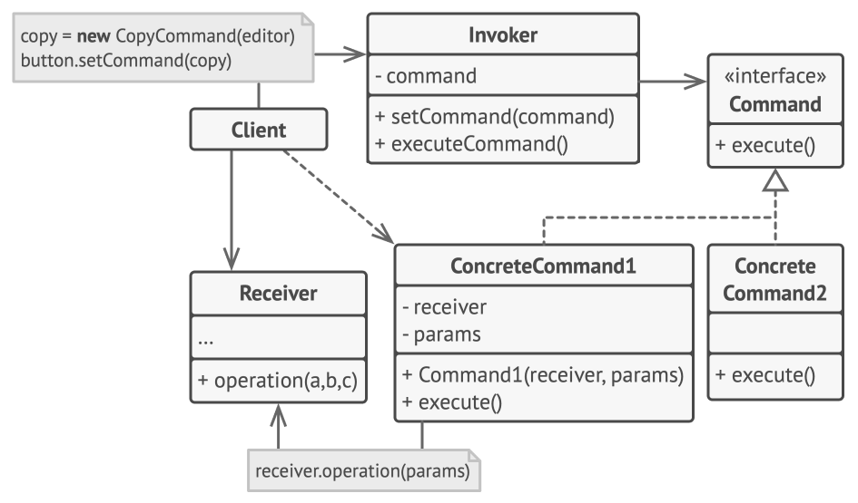

# Паттерн Command: реализация в управлении заказами

## Цель работы

Цель работы — изучить паттерн проектирования **Command** и показать его применение на практическом примере.

В качестве примера была разработана система управления заказами в интернет-магазине. В этой системе действия над заказами выполняются не напрямую из API-контроллеров, а через отдельные объекты-команды.

## Теоретическая часть

**Command** — это поведенческий паттерн проектирования, который представляет запрос или действие в виде отдельного объекта.

Главная идея паттерна заключается в том, что действие не выполняется напрямую. Сначала оно «упаковывается» в объект команды. Этот объект хранит информацию о том, что нужно сделать, какие параметры для этого нужны и какой объект будет выполнять реальную работу.

Благодаря этому код, который инициирует действие, не зависит от деталей его выполнения. Он просто создаёт команду и передаёт её на выполнение.

## Когда используется паттерн Command

Паттерн Command полезен, когда в программе нужно:

— выполнять разные операции через единый интерфейс;
— передавать действия как отдельные объекты;
— сохранять историю выполненных операций;
— логировать действия пользователя или системы;
— добавлять новые операции без сильного изменения существующего кода;
— подготовить систему к возможной реализации отмены действий.

В данной работе основной акцент сделан на **едином выполнении команд** и **сохранении истории операций**.

## Основные участники паттерна

В классической структуре паттерна Command можно выделить несколько основных участников.

**Command** — общий интерфейс команды. Он определяет, какие методы должны быть у всех команд.

**Concrete Command** — конкретная команда. Она реализует отдельное действие, например создание заказа, отмену заказа или применение скидки.

**Receiver** — получатель команды. Это объект, который содержит настоящую бизнес-логику и знает, как выполнить нужную операцию.

**Invoker** — объект, который принимает команду и запускает её выполнение. Он не знает деталей конкретной операции.

**Client** — часть программы, которая создаёт команду и передаёт её Invoker’у.

## Применение паттерна в проекте

В проекте реализована система управления заказами. Пользователь взаимодействует с приложением через HTTP-запросы, которые обрабатываются FastAPI-приложением.

Без использования паттерна Command API-контроллеры могли бы напрямую вызывать методы сервиса заказов. В таком случае обработка запросов, бизнес-логика и логирование постепенно смешивались бы между собой.

В моей реализации этот подход изменён. Контроллеры не выполняют бизнес-логику напрямую. Они только создают нужную команду и передают её в `CommandManager`. После этого менеджер команд запускает команду, а команда уже обращается к сервису заказов.

Таким образом, все действия проходят через единый механизм выполнения.

## Сопоставление паттерна с кодом проекта

В проекте участники паттерна распределены следующим образом:

**Client** — FastAPI-контроллеры в файле `main.py`. Они принимают HTTP-запросы и создают команды.

**Invoker** — класс `CommandManager`. Он принимает команду, запускает её и сохраняет информацию о выполненном действии.

**Command** — базовый абстрактный класс `Command`. Он задаёт общий интерфейс для всех команд.

**Concrete Command** — конкретные классы команд: `CreateOrderCommand`, `ConfirmOrderCommand`, `CancelOrderCommand`, `ChangeAddressCommand`, `ApplyDiscountCommand`.

**Receiver** — класс `OrderService`. Именно в нём находится основная бизнес-логика работы с заказами.

## Структура проекта

Проект разделён на несколько логических частей.

Папка `models` содержит модель заказа. Она описывает данные заказа: идентификатор, имя клиента, адрес, сумму, статус и скидку.

Папка `receiver` содержит сервис `OrderService`. Он отвечает за реальные операции с заказами: создание, подтверждение, отмену, изменение адреса и применение скидки.

Папка `commands` содержит команды. Каждая команда отвечает за одно конкретное действие.

Папка `manager` содержит `CommandManager`, который выполняет команды и хранит историю действий.

Файл `main.py` содержит API-слой приложения на FastAPI.

Такое разделение делает проект более понятным: каждая часть системы отвечает только за свою задачу.

## Модель заказа

Класс `Order` представляет заказ в системе.

В заказе хранятся основные данные: id, имя клиента, адрес доставки, сумма заказа, статус и процент скидки. Также в модели есть вычисляемые свойства, например итоговая сумма заказа с учётом применённой скидки.

Модель отвечает именно за состояние заказа. Она не занимается обработкой HTTP-запросов и не управляет выполнением команд.

## Receiver: сервис заказов

Класс `OrderService` выполняет роль Receiver.

Он содержит основную бизнес-логику приложения и знает, как выполнять операции с заказами. Через него создаются заказы, выполняется поиск заказа по id, изменяется статус, применяется скидка и меняется адрес доставки.

Например, если нужно подтвердить заказ, команда не изменяет статус самостоятельно. Она обращается к `OrderService`, а сервис уже выполняет нужную операцию.

Это важный момент, потому что бизнес-логика остаётся в одном месте и не дублируется в контроллерах или командах.

## Command: общий интерфейс команд

Базовый класс `Command` задаёт общий интерфейс для всех команд.

В моей реализации каждая команда должна выполнять две основные задачи:

— запускать действие;
— возвращать описание выполненной операции.

Метод `execute` отвечает за выполнение команды.

Метод `describe` возвращает информацию о команде: её название и параметры. Эта информация используется для формирования истории выполненных операций.

Благодаря общему интерфейсу `CommandManager` может работать с любой командой одинаково.

## Concrete Command: конкретные команды

Каждая конкретная команда отвечает только за одну операцию.

Например, команда создания заказа хранит данные, необходимые для создания заказа: имя клиента, адрес и сумму. При выполнении она вызывает соответствующий метод сервиса заказов.

Команда подтверждения заказа хранит id заказа и вызывает метод подтверждения.

Команда применения скидки хранит id заказа и процент скидки.

Такой подход делает каждое действие самостоятельным объектом. Команду можно создать, передать, выполнить, описать и сохранить в истории.

## Invoker: CommandManager

`CommandManager` выполняет роль Invoker.

Его задача — принять команду, вызвать её выполнение и сохранить описание выполненного действия.

При этом `CommandManager` не знает, что именно делает конкретная команда. Для него все команды выглядят одинаково: у каждой есть общий интерфейс выполнения.

Это одна из главных идей паттерна Command: объект, который запускает команды, не зависит от деталей конкретных операций.

## API-слой

FastAPI-приложение выступает в роли Client.

Когда пользователь отправляет HTTP-запрос, соответствующий endpoint создаёт объект нужной команды и передаёт его в `CommandManager`.

Например, при создании заказа API-метод получает данные пользователя, создаёт команду создания заказа и отправляет её на выполнение.

Контроллер при этом остаётся простым. Он не содержит бизнес-логики, а только связывает HTTP-запрос с нужной командой.

## Общая схема работы системы

Работа системы происходит по следующему сценарию.

Пользователь отправляет HTTP-запрос.

FastAPI-контроллер принимает запрос и создаёт объект нужной команды.

Команда передаётся в `CommandManager`.

`CommandManager` вызывает выполнение команды.

Команда обращается к `OrderService`.

`OrderService` выполняет бизнес-логику и возвращает результат.

`CommandManager` сохраняет описание команды в истории.

Результат возвращается пользователю.

## Диаграмма паттерна

## Реализованные операции

В проекте реализованы основные операции для работы с заказами:

— создание заказа;
— получение списка заказов;
— получение заказа по id;
— подтверждение заказа;
— отмена заказа;
— изменение адреса заказа;
— применение скидки;
— просмотр истории выполненных команд.

Эти операции позволяют наглядно показать, что разные действия выполняются через один и тот же механизм команд.

## История команд

Одной из важных частей реализации является история команд.

После выполнения каждой команды `CommandManager` сохраняет её описание. В описание входит название команды и параметры, с которыми она была вызвана.

Например, если был создан заказ, в истории будет сохранено, что была выполнена команда создания заказа, а также будут указаны основные параметры этой операции.

Это удобно для отладки, анализа работы системы и демонстрации того, что все действия действительно проходят через единый механизм.

## Преимущества реализации

Первое преимущество — **разделение ответственности**.

API-слой отвечает только за обработку HTTP-запросов. Команды описывают действия. `OrderService` содержит бизнес-логику. `CommandManager` отвечает за выполнение команд и сохранение истории.

Второе преимущество — **единый способ выполнения операций**.

Любая операция выполняется через `CommandManager`. Неважно, создаётся заказ, отменяется или изменяется адрес. Для менеджера это просто команда.

Третье преимущество — **централизованное логирование**.

История действий сохраняется в одном месте. Не нужно отдельно добавлять логирование в каждый endpoint.

Четвёртое преимущество — **расширяемость**.

Чтобы добавить новую операцию, достаточно создать новый класс команды и добавить соответствующую бизнес-логику в сервис. Уже существующие команды при этом менять не нужно.

Пятое преимущество — **возможность дальнейшего развития**.

В текущей реализации отмена действий не реализована, но паттерн Command хорошо подходит для добавления такой возможности в будущем. Для этого можно расширить команды методом `undo` и сохранять предыдущее состояние заказа.
